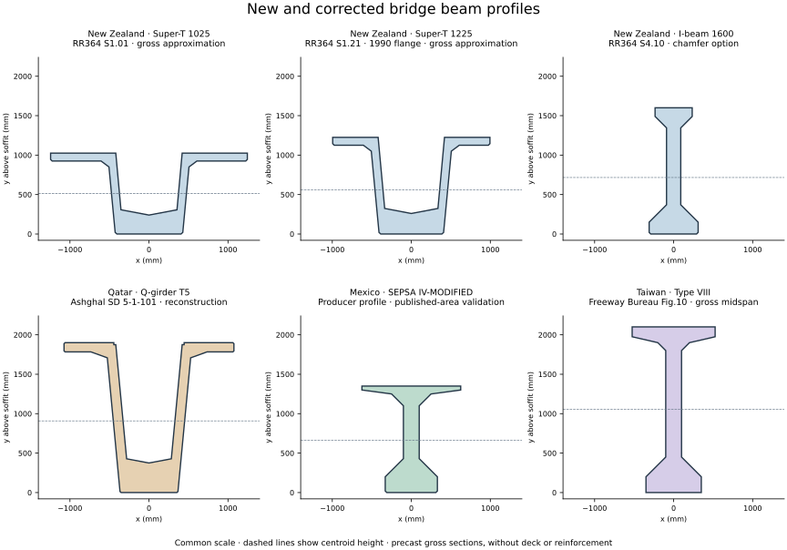
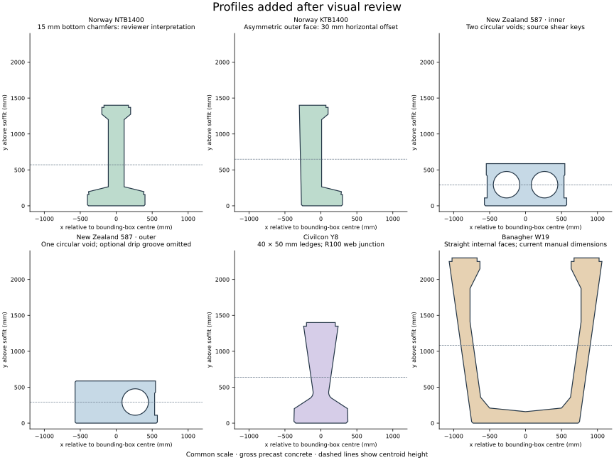

# Global bridge beams

`bridgebeams` has two related collections: implemented section geometry and
sources for additional families. They have different evidence requirements.
The [research catalogue](research.md) records original titles, English
translations, dimensions, source URLs and remaining blockers from the
September 2026 international search.

The **research footprint** includes source records for 114 jurisdictions;
this is not a claim of 114 countries with implemented beam geometry.
See {doc}`coverage` for the complete country list and clickable heat map.
Its counts distinguish fixed profiles, parametric templates and researched
sources. The table below is only the implemented-family summary.

## Implemented families

| Jurisdiction | Module | Families | Evidence limits |
|---|---|---|---|
| Australia | `bridgebeams.aus` | Super-T T1–T5; I-girders 1–4 | AS5100.5 Appendix D; historical variants retained |
| Canada (Ontario) | `bridgebeams.ca` | MTO S300/S400/S500 solid slabs | June 2025 standard drawings; Ontario-specific gross sections |
| Ireland | `bridgebeams.ie` | T, TY/TYE, Y/YE, U/SU, M/UMB, SY/SYE, MY/MYE, Solid Box, W | Source-specific exact and reconstructed profiles; SD class 4 discrepancies retained |
| United Kingdom | `bridgebeams.uk` | Banagher producer range, shared with Ireland | Availability aliases retain the same profile IDs and geometry; not a separate national standard |
| United States (MN, WA) | `bridgebeams.us` | MnDOT 14RB/18RB/22RB; WSDOT W42G/W50G/W58G/W74G | Edition-specific official drawings; WSDOT geometry independently checked against 2025 published properties |
| Belgium | `bridgebeams.be` | FEBE standardised I-beams | Flange thicknesses must be supplied by the designer |
| Greece | `bridgebeams.gr` | Egnatia extended-I families | Published depth law/widths; flange thicknesses are design inputs |
| Japan | `bridgebeams.jp` | JIS/PCCEN AG/BG T-girders | Chubu drawing metadata; additional drawing audit is in the PDF report |
| Korea | `bridgebeams.kr` | KHC PSC I-girders | Published 25/30/35 m data; 20/40 m sizes are extrapolated |
| Mexico | `bridgebeams.mx` | SEPSA I-MODIFIED, II, III, IV, IV-MODIFIED, V, VI | Producer-specific metric profiles; published areas match within 50 mm² rounding |
| New Zealand | `bridgebeams.nz` | RR364 Super-T; I-beams; 587/650/900 hollow-core | Gross profiles; 650/900 outer units remain excluded |
| Norway | `bridgebeams.no` | Five NTB and five KTB profiles | 15 mm bottom chamfers are reviewer-inferred |
| Poland | `bridgebeams.pl` | Mosty-Łódź T12–T27 | Family-specific dimension/provenance metadata |
| Qatar | `bridgebeams.qa` | Ashghal Q-girders T1–T5 | Documented reconstruction; maximum A/centroid/Ixx deviations 0.88%/0.85%/1.26% |
| Russia | `bridgebeams.ru` | 3.503.1-81, 33 m I-beams | Fitted flange profile validated against producer volumes |
| South Africa | `bridgebeams.za` | Civilcon I1–I20, Y1–Y8 | Reviewed source geometry; individual property discrepancies preserved |
| Taiwan | `bridgebeams.tw` | Freeway Bureau Types IV–VIII | Dimensioned post-tensioned gross midspan profiles; analytically checked |
| Thailand | `bridgebeams.th` | DOH IG-205 | Published 20 m standard drawing |
| Türkiye | `bridgebeams.tr` | KGM-lineage I90/I120/I140/I170 | Worked-example profile assumptions; project drawing confirmation needed |

Banagher's documented Ireland/UK catalogue is available through both `bridgebeams.ie` and `bridgebeams.uk`; the UK exports alias the same producer geometry. Other UK designs require their own evidence and implementations.

## India and research-only countries

India has its own coverage entry and {doc}`india-followup` source report.
Official evidence includes RDSO railway standard girders, MoRTH precast RCC
standard drawings, an NHAI precast PSC-I drawing and IRICEN references.
No Indian profile constructor is claimed yet: the surviving section details
need complete readable dimensions. An earlier failed local download was an
access limitation, not absence of Indian precast beams.

## Expanded source collection

See {doc}`research` for the complete regional reports and downloadable JSON:

- {doc}`research-europe-americas`: highway-agency standards, national
  catalogues and producer families across Europe and the Americas.
- {doc}`research-asia-africa`: Asia, Middle East and African sources, with
  English translations and explicit access limits.
- {doc}`research-pdf-transcription`: direct checks of the Qatar, New Zealand,
  Norway and Japan drawing backlog, including corrections to older notes.

The source records distinguish inspected documents from search leads and
unavailable downloads. Overall depths and widths alone do not define an
exact section. Some publications give independently tabulated area, centroid
and inertia; others still need internal haunch/flange dimensions.

## How to use the collection

Select a family by the original designation and source revision. Read its
accuracy statement before calculating section properties. For a researched
family that is not implemented, use the page-specific transcription and
original source to establish all necessary dimensions, then validate the
resulting polygon against independent published properties where available.

The new and audited families use millimetres and a soffit-based vertical
coordinate. Legacy Australian classes retain their existing negative-y
coordinate convention and older interface; check the family API. Research
records retain source units; centroid direction and inertia units must be
converted explicitly. Source publications remain copyrighted and are kept
as ignored local working materials. Their factual dimensions and provenance
are retained in versioned records.
